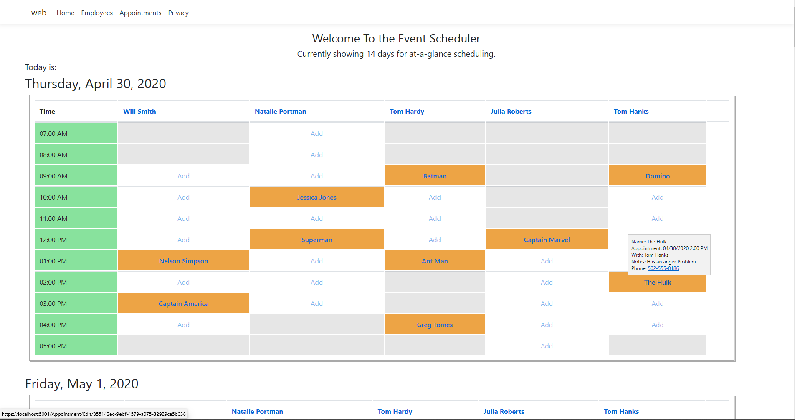
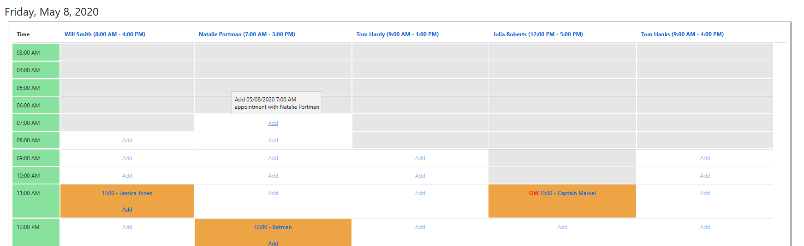
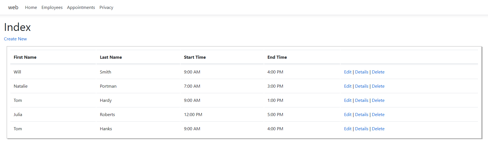

# **Scheduler**

## **Overview/Project Summary**
This is an event scheduler. A suggested use would be at a conference that lasted several days. The software allows appointments to be scheduled on a variety of employees. Each employee has first and last appointment time per day.  Each appointment is able to be scheduled on an employee with a variety of information (ex: Name, Phone number, notes, requested time). Employees and appointments can be created, read, updated, and deleted. 

## **Technical Summary**
* Backend: C#
*Framework: ASP.NET Core MVC
* ORM: EF Core
* Server: IIS
* DB: SQL
* Front End: HTML/CSS, Bootstrap/ JQuery

## **Getting Started**
* Clone the project
* Build the application
* Enjoy creating, reading, updating, and deleting appointments on the event scheduler.

## **Features**

* Home/Index Page 
    * Allows at-a-glance visual view of the schedule for the current day as well as any number of subsequent days. (Variable is set in Home - Index.cshtml). The suggestion is to set this variable for the length of the event (ex: 5 days). 
    * Each day shows only the range of on the hour valid times slots for the employees and the earliest and latest appointments for that day.
    * Appointment Quick Add links within the employee work window will be shown. Clicking the Quick Add link will url route to the on the hour time for that employee for appointment creation. Hovering over the Quick Add link shows the Date, Time, and employee for the potential appointment.
    * For each hour, appointments will be listed for each employee. Hovering over the appointment link shows name, phone number, appointment notes, and appointment date/time. Clicking an appointment link routes the user to the appointment edit function. 
    * **D**ouble **B**ooked apointments and appointments **O**utside the **W**indow for work will be coded with **DB** and **OW** respectively indicating that status.
    * Clicking on an employee link allows for editing of the information for that employee. Changes in the employee's work window will change the visual view of the schedule for that day as well any **OW** coding.
***
--> Home Index, At a glance view showing hover information for an established appointment
    
***
--> Home Index, At a glance view showing hover for adding an appointment
  
***
-->Home Index, at a glance view showing double booked coding, multiple appointments in hour span, appointments outside of work window
 
***

* Employee/Index Page
    * Allows employees and information to be created, read, updated, and deleted
***
--> View of the Employee Index Page

***
* Apointments/Index Page
    * Allows appointments to be created, read, updated, and deleted.
    * In nonfiltered/nonsearched view, the appointments are sorted in chronological order by default.
    * In nonfiltered/nonsearched views, sorting by some fields (descending/ascending) is allowed.
    * Search/filter function is available for some fields.
    * A message under the search box will indicate 1.) the number of entries displayed, 2.) whether the filter/search function is being used, 3.) the search entry, and 4.) the field that is being searched.
    * If no records are found with a search, a message will also display in the table.
    * Upon attempted creation of an appointment that overlaps with another appointment on that same employee -- an error message will display and indicate which employees have an opening at that time. 
    * Upon attempted creation of an appointment that is scheduled outside of employee's work window -- an error message will display showing the work window of that employee. 
    * After 'valid' appointment creation, the user can purposely doublebook an appointment or set an appointment outside of the employee's work window by editing the appointment. Coding will appear on the appointments index page (ex: DB, OW) where applicable.
***
--> View of the appointments Page

***
--> Appointment Search Function

***
--> Outside work window error/validation

***

***
-> Outside work window error/validation

***

## **Milestones**
- [x] Create a GitHub Repo and Start on a Project Plan
- [x] Scaffold a new .NET Core MVC Application
- [x] Model Relational Scheduler Data
- [x] Generating a Code First Database
- [x] Creating CRUD Controllers
- [x]  Creating CRUD Views

