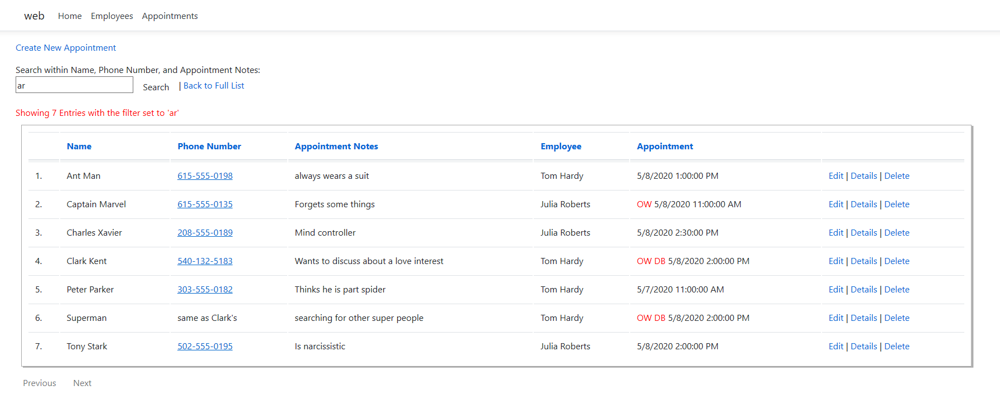

# **Scheduler**

## **Overview/Project Summary**
This is an event scheduler. A suggested use would be at a conference that lasted several days. The software allows appointments to be scheduled on a variety of employees. Each employee has a start and end time per day. Each appointment is assumed to be an hour time slot. Each appointment is able to be scheduled on an employee with a variety of information (ex: Name, Phone number, notes, requested time). Employees and appointments can be created, read, updated, and deleted. 

## **Technical Summary**
* Backend: C#
*Framework: ASP.NET Core MVC
* ORM: EF Core
* Server: IIS
* DB: SQL
* Front End: HTML/CSS, Bootstrap/ JQuery

## **Getting Started**
* Clone the project
* Build the application
* Scaffold an initial migration
* Enjoy creating, reading, updating, and deleting appointments on the event scheduler.

## **Features**

* Home/Index Page 
    * Allows at-a-glance visual view of the shedule for the current day as well as any number of days. (Variable is set in Home - Index.cshtml). The suggestion is to set this variable for the length of the event (ex: 5 days). As the event progresses it will give an at a glance view of what to expect for coming days.
    * Each day shows only the range of valid times slots for the employees and the earliest and latest appointments for that day.
    * Only appointment 'Add' links within the employee work window will be shown. Clicking the 'Add' link will url route to the appropriate time slot and employee for appointment creation. Hovering over the 'Add' link shows the Date, Time, and employee for the potential appointment.
    * On the hour appointments will show for the employee. Hovering over the appointment link shows name, phone number, appointment notes, Employee name, and appointment date/time. Clicking an appointment link routes the user to the appointment edit function. 
    * Clicking on an employee link allows for editing of the information for that employee. Changes in the employees work window will change the visual view of the schedule for that day. 

    

* Employee/Index Page
    * Allows employees to be created, read, updated, and deleted

* Apointments/Index Page
    * Allows appointments to be created, read, updated, and deleted.
    * In nonfiltered/nonsearched view, the appointments are sorted in chronological order by default.
    * In nonfiltered/nonsearched views, sorting by some fields (descending/ascending) is allowed.
    * Search/filter function is available for some fields.
    * A message under the search box will indicate the number of entries displayed, if the filter/search function is being used, the search entry, and the field that is being searched.
    * If no records are found with a search a message will also display in the table.
    * Upon attempted creation of an appointment that overlaps with another appointment on that same employee -- an error message will display and indicate which employees have an opening at that time slot. 
    * Upon attempted creation of an appointment that is scheduled outside of employee's work window -- an error message will display showing the work window of that employee. 
    * However, after creation, the user can purposely doublebook an appointment or set an appointment outside of the employee's work window by editing the appointment. 

## **Milestones**
- [x] Create a GitHub Repo and Start on a Project Plan
- [x] Scaffold a new .NET Core MVC Application
- [x] Model Relational Scheduler Data
- [x] Generating a Code First Database
- [x] Creating CRUD Controllers
- [x]  Creating CRUD Views

